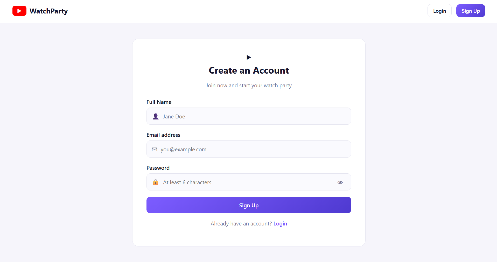
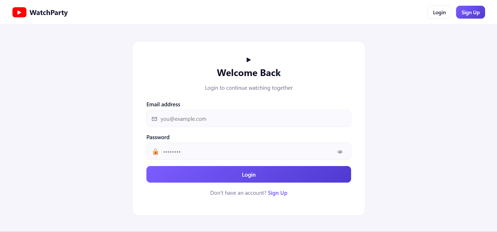
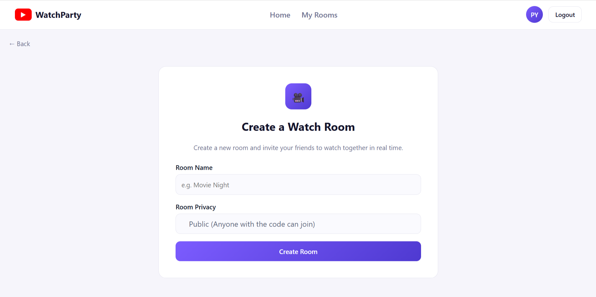
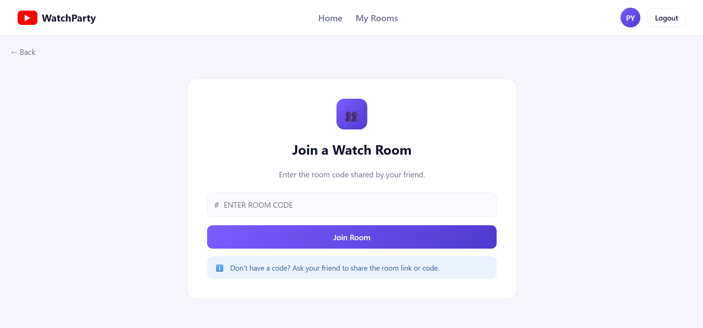
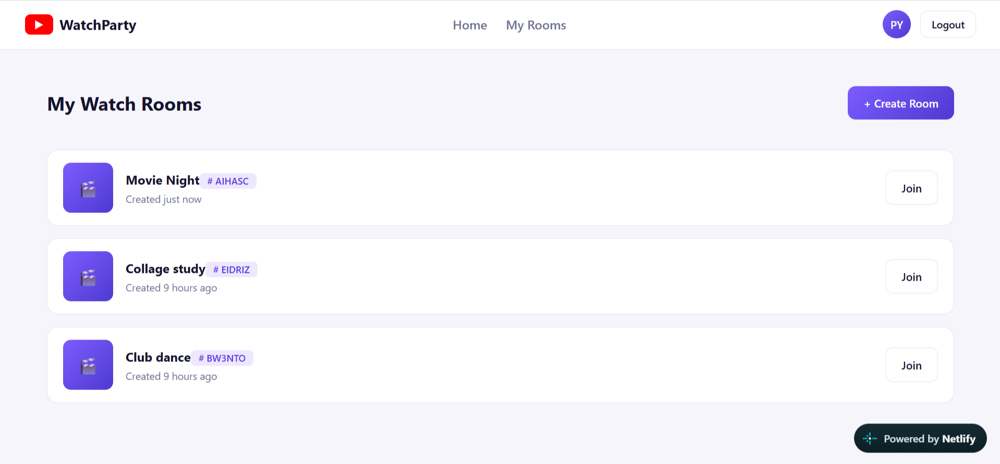
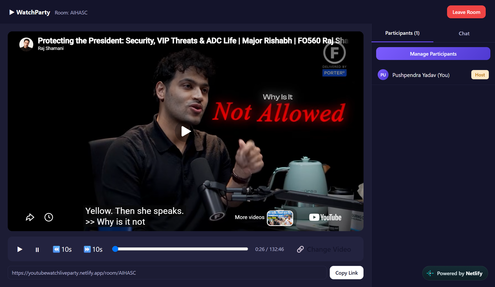
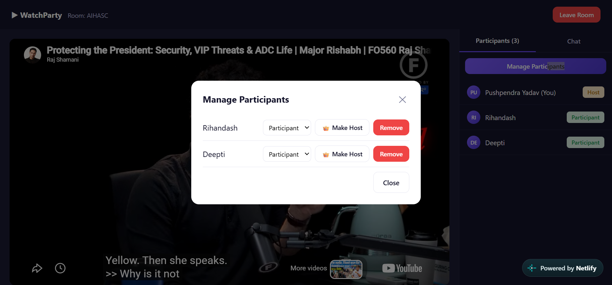
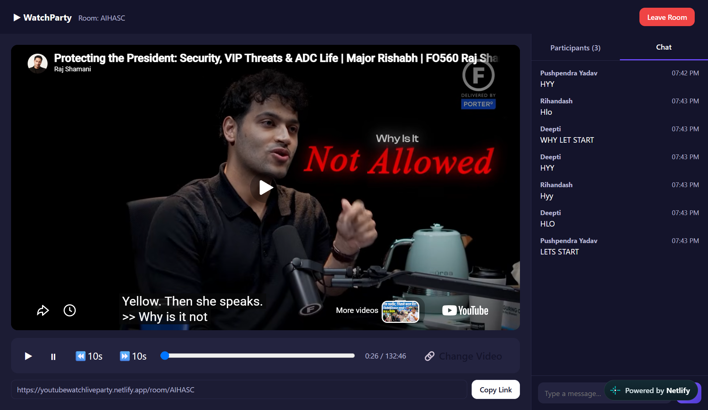

# 🎬 YouTube Watch Party

A real-time, synchronized YouTube watching app — create a room, share the room code with friends, and watch a video together with synced play/pause/seek, live chat, and host/moderator controls.

**Live Demo:** [https://youtubewatchliveparty.netlify.app/](https://youtubewatchliveparty.netlify.app)

---

## ✨ Features

- **Auth** — signup/login with hashed passwords (bcrypt) and a simple token-based session (`x-auth-token` header)
- **Rooms** — create a public or private room, get a short shareable room code (e.g. `X7K9P2`)
- **Synchronized playback** — play, pause, and seek events are broadcast to everyone in the room in real time via Socket.IO
- **Roles** — `Host`, `Moderator`, `Participant`
  - Host and Moderator can control playback and change the video
  - Host can promote/demote roles, transfer host, and remove participants
- **Live chat** inside the watch room
- **Dashboard** — see the rooms you've created
- **Join by code** — jump into an existing room with just the room code

---

## 🏗️ Tech Stack

| Layer | Technology |
|---|---|
| Frontend | React , React Router , Vite, Socket.IO client |
| Backend | Node.js, Express, Socket.IO |
| Database | MongoDB (via Mongoose) |
| Auth | bcryptjs (password hashing) + custom token auth |
| Deployment | Netlify(Frontend) and Render(backend) |

---


## ⚙️ Prerequisites

- [Node.js](https://nodejs.org/) v18+ and npm
- A [MongoDB](https://www.mongodb.com/) database (local install or a free [MongoDB Atlas](https://www.mongodb.com/cloud/atlas) cluster)
- Git

---

## 🚀 Setup & Run Locally

### 1. Clone the repository

```bash
git clone https://github.com/pushpendra-yadav8650/youtube-watch-party.git
cd youtube-watch-party
```

### 2. Backend setup

```bash
cd backend
npm install
```

Create a `.env` file inside `backend/`:

```bash
PORT=5000
MONGO_URI=your_mongodb_connection_string
CLIENT_ORIGIN=http://localhost:5173
```

Run the backend:

```bash
# development (auto-restart with nodemon)
npm run dev

# production
npm start
```

The API will be available at `http://localhost:5000`.

### 3. Frontend setup

Open a new terminal:

```bash
cd frontend
npm install
```

Create a `.env` file inside `frontend/`:

```bash
VITE_API_URL=http://localhost:5000
```

Run the frontend:

```bash
npm run dev
```

The app will be available at `http://localhost:5173`.

### 4. Build for production (frontend)

```bash
cd frontend
npm run build
npm run preview   # preview the production build locally
```

---

## 🔑 Environment Variables Reference

**backend/.env**
| Variable | Description |
|---|---|
| `PORT` | Port the Express/Socket.IO server listens on |
| `MONGO_URI` | MongoDB connection string |
| `CLIENT_ORIGIN` | URL of the deployed/local frontend (used for CORS) |

**frontend/.env**
| Variable | Description |
|---|---|
| `VITE_API_URL` | URL of the backend API/Socket.IO server |

---

## 🌐 API Endpoints

| Method | Endpoint | Auth | Description |
|---|---|---|---|
| POST | `/api/auth/signup` | ❌ | Create a new account |
| POST | `/api/auth/login` | ❌ | Log in, returns a token |
| POST | `/api/auth/logout` | ✅ | Invalidate the current token |
| GET | `/api/auth/me` | ✅ | Get the logged-in user's profile |
| POST | `/api/rooms` | ✅ | Create a new room |
| GET | `/api/rooms/mine` | ✅ | List rooms created by the logged-in user |
| GET | `/api/rooms/:roomCode` | ✅ | Get a room by its code |
| GET | `/api/health` | ❌ | Health check |

Authenticated requests must include an `x-auth-token` header with the token returned from signup/login.

---

## 🔌 Socket.IO Events

| Event (client → server) | Payload | Description |
|---|---|---|
| `join_room` | `{ roomId, userId, username, isCreator }` | Join a room |
| `leave_room` | — | Leave the current room |
| `play` | `{ currentTime }` | Broadcast play |
| `pause` | `{ currentTime }` | Broadcast pause |
| `seek` | `{ time }` | Broadcast seek |
| `change_video` | `{ videoId }` | Change the video (Host/Moderator only) |
| `assign_role` | `{ userId, role }` | Change a participant's role (Host only) |
| `transfer_host` | `{ userId }` | Hand off host to another participant |
| `remove_participant` | `{ userId }` | Kick a participant (Host only) |
| `chat_message` | `{ message }` | Send a chat message |

| Event (server → client) | Description |
|---|---|
| `user_joined` / `user_left` | Participant list updates |
| `sync_state` | `{ videoId, playState, currentTime }` — playback sync |
| `role_assigned` | Role change broadcast |
| `participant_removed` / `you_were_removed` | Kick notifications |
| `chat_message` | Incoming chat message |
| `error_message` | Action was rejected (e.g. no permission) |

---
## 📸 Screenshots

## Home 

  

## Signup 



## Login 

 

## Create Room 

 

## Join Room 

 

## All Rooms 

 

## Watch Party 

 

## ManageParticipants 

 

 ## Chats

 

